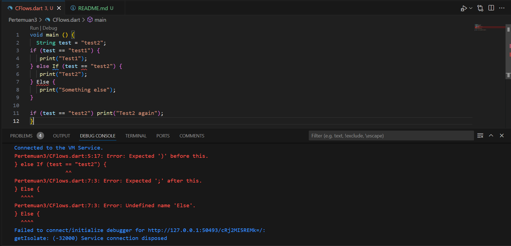
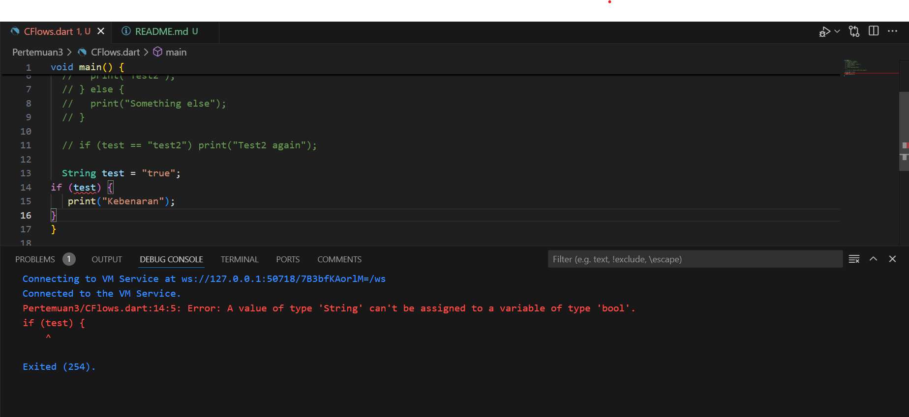
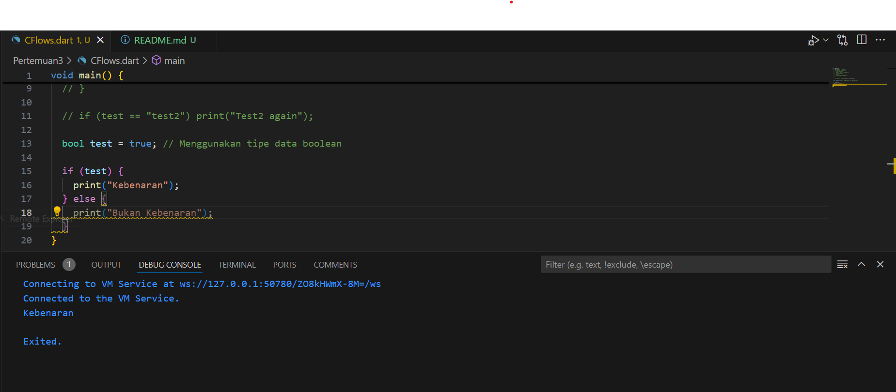
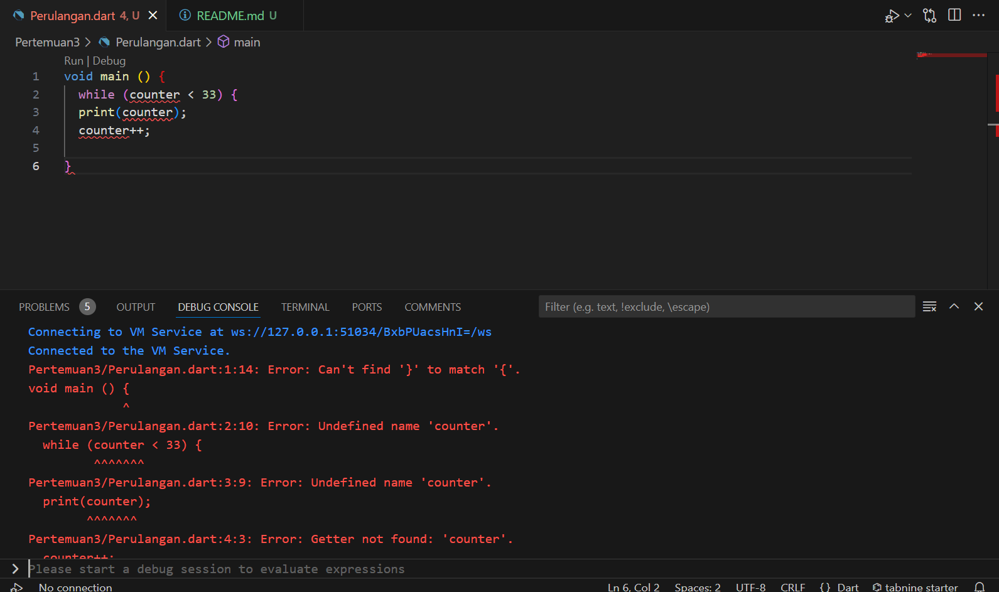
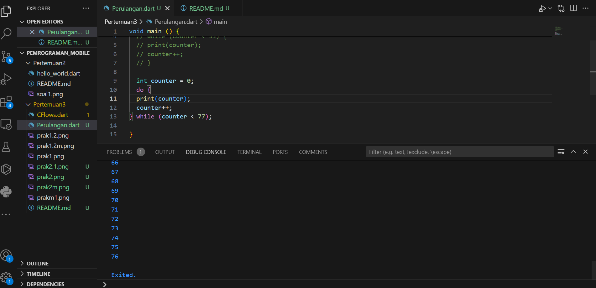
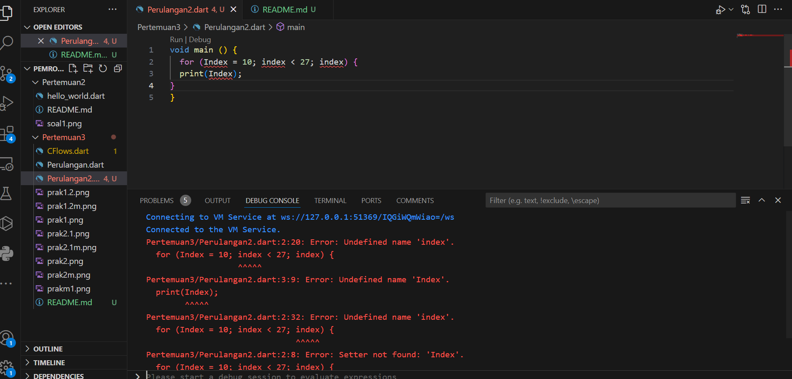
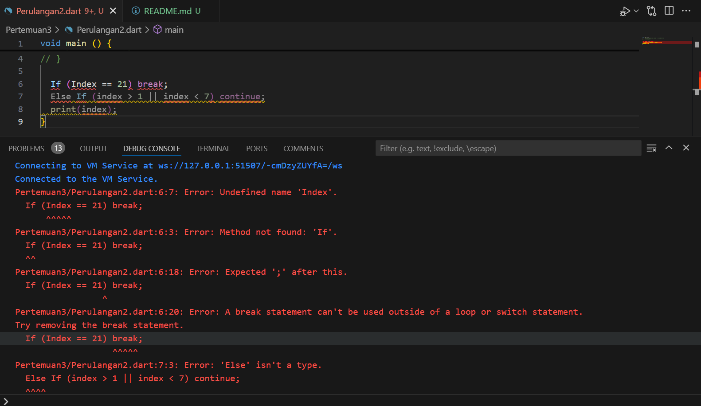

# LAPORAN PRATIKUM PERTEMUAN 3 DART-BAGIAN 2
Nim : 2241760069  
Nama: Anas Nurhidayat  / 09  
Kelas: SIB-3D 

### PRATIKUM 1 Menerapkan Control Flows ("if/else")!   

#### 1. Ketik atau salin kode program berikut ke dalam fungsi main(). Silakan coba eksekusi (Run) kode pada langkah 1 tersebut. Apa yang terjadi? Jelaskan!

        String test = "test2";
        if (test == "test1") {
        print("Test1");
        } else If (test == "test2") {
        print("Test2");
        } Else {
        print("Something else");
        }

        if (test == "test2") print("Test2 again");

Hasil Running  :     
 

- Penjelasan : akan terjadi error saat program dart dijalankan. karena terdapat penulisan kata kunci if dan else yang salah. seharusnya ditulis dengan hruf kecil semua.
    
    
- Hasil Modifikasi  :  

#### 2. Tambahkan kode program berikut, lalu coba eksekusi (Run) kode Anda. Apa yang terjadi ? Jika terjadi error, silakan perbaiki namun tetap menggunakan if/else.

        String test = "true";
        if (test) {
        print("Kebenaran");
        }

Hasil Running  :     
 

- Penjelasan : akan terjadi error saat program dart dijalankan. karena terdapat tipe data yang tidak  sesuai yang seharusnya menggunakan tipe data boolean (true/false).

Hasil Modifikasi  :  

   

### PRATIKUM 2 Menerapkan Perulangan "while" dan "do-while" 
#### 1. Ketik atau salin kode program berikut ke dalam fungsi main().  Silakan coba eksekusi (Run) kode pada langkah 1 tersebut. Apa yang terjadi? Jelaskan! Lalu perbaiki jika terjadi error.   

        while (counter < 33) {
        print(counter);
        counter++;
        }  

Hasil Running  :      

 

- Penjelasan : akan terjadi error saat program dart dijalankan. karena belum ada variabel counter yang dideklarasikan. Didalam Dart, semua veriabel harus di deklarasian sebelum digunakan.

Hasil Modifikasi  :    

#### 2. Tambahkan kode program berikut, lalu coba eksekusi (Run) kode Anda. Apa yang terjadi ? Jika terjadi error, silakan perbaiki namun tetap menggunakan do-while.

        do {
        print(counter);
        counter++;
        } while (counter < 77);  
  
Hasil Running  :     
 

- Penjelasan : akan terjadi error saat program dart dijalankan. karena belum ada variabel counter yang dideklarasikan. Didalam Dart, semua veriabel harus di deklarasian sebelum digunakan.
  

Hasil Modifikasi  :    

### PRATIKUM 3 Menerapkan Perulangan "for" dan "break-continue
#### 1.Ketik atau salin kode program berikut ke dalam fungsi main(). Silakan coba eksekusi (Run) kode pada langkah 1 tersebut. Apa yang terjadi? Jelaskan! Lalu perbaiki jika terjadi error.

        for (Index = 10; index < 27; index) {
        print(Index);
        }

Hasil Running  :       

 

- Penjelasan : akan terjadi error saat program dart dijalankan. karena belum ada variabel int yang dideklarasikan, kesalahan penulisan Index yang seharusnya harus menggunakan huruf kecil(index),  harus ada pernyataan nilai index dalam setiap iterasi.  

- Hasil Modifikasi  :    

#### 2. Tambahkan kode program berikut, lalu coba eksekusi (Run) kode Anda. Apa yang terjadi ? Jika terjadi error, silakan perbaiki namun tetap menggunakan for dan break-continue.

        If (Index == 21) break;
        Else If (index > 1 || index < 7) continue;
        print(index);
  
Hasil Running  :     
 

- Penjelasan : akan terjadi error saat program dart dijalankan. karena terdapat kesalahan penulisan If dan Else If , kesalahan operator (OR)| | yang seharusnya memakai (AND) && .   

Hasil Modifikasi  :    

