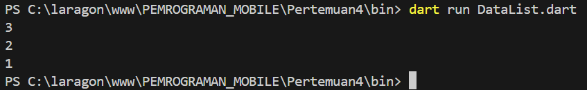
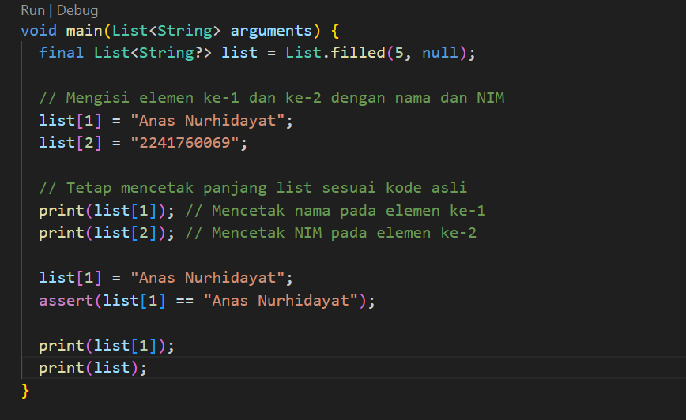
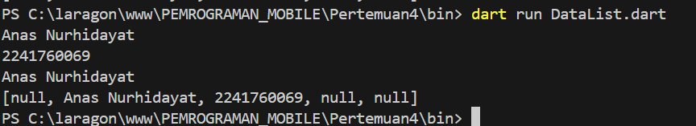
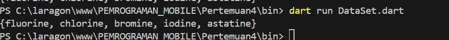

# LAPORAN PRATIKUM PERTEMUAN 4 DART-BAGIAN 3
Nim : 2241760069  
Nama: Anas Nurhidayat  / 08  
Kelas: SIB-3D 

### PRATIKUM 1  Eksperimen Tipe Data List   

#### 1. Ketik atau salin kode program berikut ke dalam void main(). Silakan coba eksekusi (Run) kode pada langkah 1 tersebut. Apa yang terjadi? Jelaskan!

            var list = [1, 2, 3];
            assert(list.length == 3);
            assert(list[1] == 2);
            print(list.length);
            print(list[1]);

            list[1] = 1;
            assert(list[1] == 1);
            print(list[1]);

Hasil Running  :     
 

#### 2. Ubah kode pada langkah 1 menjadi variabel final yang mempunyai index = 5 dengan default value = null. Isilah nama dan NIM Anda pada elemen index ke-1 dan ke-2. Lalu print dan capture hasilnya. Apa yang terjadi ? Jika terjadi error, silakan perbaiki.

       
Modifikasi Program  :     
    

 Hasil Running  :     
 

- Penjelasan : dari hasil modifikasi program diatas, maka program akan membuat list dengan panjang 5 dan nilai awal null, kemudian mengisi kedua elemen pada indeks ke 1 dan ke 2 dengan nama AnasNurhidayat dan NIM 2241760069. Elemen lain (indeks 0,3 dan 4) tetap bernilai NUll. Nama dan nim dicetak, dan seluruh list ditampilkan.

   

### PRATIKUM 2 Eksperimen Tipe Data Set 

#### 1. Ketik atau salin kode program berikut ke dalam fungsi main().  Silakan coba eksekusi (Run) kode pada langkah 1 tersebut. Apa yang terjadi? Jelaskan! Lalu perbaiki jika terjadi error.   

            var halogens = {'fluorine', 'chlorine', 'bromine', 'iodine', 'astatine'};
            print(halogens);

Hasil Running  :      

 

- Penjelasan : Dari program di atas tidak terjadi error dan akan menampilkan semua elemen yang ada dalam set. 

Hasil Modifikasi  :    

#### 2. Tambahkan kode program berikut, lalu coba eksekusi (Run) kode Anda. Apa yang terjadi ? Jika terjadi error, silakan perbaiki namun tetap menggunakan do-while.

        do {
        print(counter);
        counter++;
        } while (counter < 77);  
  
Hasil Running  :     
 

- Penjelasan : akan terjadi error saat program dart dijalankan. karena belum ada variabel counter yang dideklarasikan. Didalam Dart, semua veriabel harus di deklarasian sebelum digunakan.
  

Hasil Modifikasi  :    

### PRATIKUM 3 Menerapkan Perulangan "for" dan "break-continue
#### 1.Ketik atau salin kode program berikut ke dalam fungsi main(). Silakan coba eksekusi (Run) kode pada langkah 1 tersebut. Apa yang terjadi? Jelaskan! Lalu perbaiki jika terjadi error.

        for (Index = 10; index < 27; index) {
        print(Index);
        }

Hasil Running  :       

 

- Penjelasan : akan terjadi error saat program dart dijalankan. karena belum ada variabel int yang dideklarasikan, kesalahan penulisan Index yang seharusnya harus menggunakan huruf kecil(index),  harus ada pernyataan nilai index dalam setiap iterasi.  

- Hasil Modifikasi  :    

#### 2. Tambahkan kode program berikut, lalu coba eksekusi (Run) kode Anda. Apa yang terjadi ? Jika terjadi error, silakan perbaiki namun tetap menggunakan for dan break-continue.

        If (Index == 21) break;
        Else If (index > 1 || index < 7) continue;
        print(index);
  
Hasil Running  :     
 

- Penjelasan : akan terjadi error saat program dart dijalankan. karena terdapat kesalahan penulisan If dan Else If , kesalahan operator (OR)| | yang seharusnya memakai (AND) && .   

Hasil Modifikasi  :    

### TUGAS PRATIKUM

#### 1.  Buatlah sebuah program yang dapat menampilkan bilangan prima dari angka 0 sampai 201 menggunakan Dart. Ketika bilangan prima ditemukan, maka tampilkan nama lengkap dan NIM Anda.  

Kode Program :    
        void main () {
        int counter = 0;

        while (counter < 33) {
        print(counter);
        counter++;
        }

        do {
        print(counter);
        counter++;
        } while (counter < 77);
        
        }  

Hasil Running  :  
   

